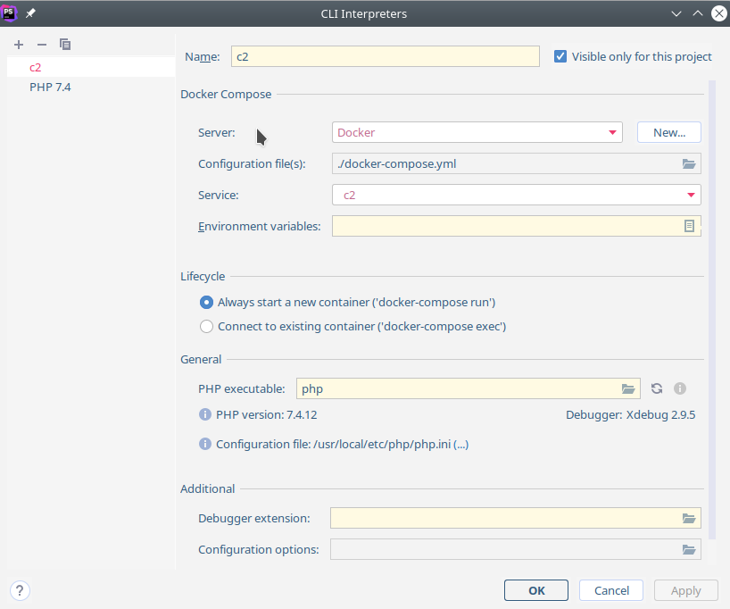

# Reproduce Codeception/PhpStorm Bug

* Bring up the containers:
```
docker-compose up -d --build

```

* Install composer dependencies:
```
docker-compose exec mysite /bin/bash
# in container:
cd /var/www/test
php composer.phar install
```

* Configure PHPStorm to use remote (docker-compose) php interpreter of `c2` service:




* Run the test: Right click on `tests/function/BuggyCest.php` and run with Codeception.
